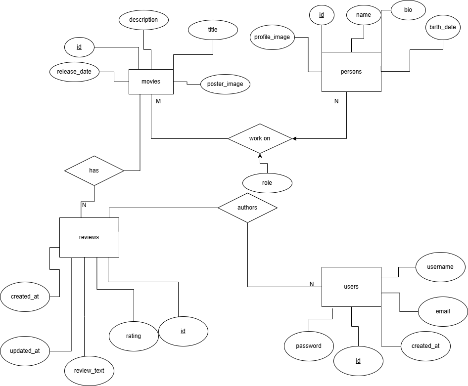

# 🎬 Movie Reviews Web Application

A backend-focused server-side web application built with **Go** and **MySQL** as part of a learning project, exploring database design, clean architecture, and server-side rendering. Currently under active development.

---

## 📋 Table of Contents

- [Overview](#overview)
- [Tech Stack](#tech-stack)
- [Project Structure](#project-structure)
- [Database Design](#database-design)
- [API Routes](#api-routes)
- [Getting Started](#getting-started)
- [Current Status](#current-status)

---

## Overview

Movie Reviews is a server-side web application focused on backend architecture and database design. The project emphasises clean code structure, relational data modelling, and server-side rendering using Go's standard library. The frontend UI is still a work in progress.

Currently implemented:

- Movie listing and detail pages served via HTML templates
- Database models for movies, persons, and movie-person relationships (cast/filmography)
- Full database schema design including users and reviews tables (feature implementation planned)

The project follows a clean layered architecture with clear separation between HTTP handlers, routing, and database models.


---

## Tech Stack

| Layer       | Technology                       |
|-------------|----------------------------------|
| Language    | Go (Golang) 1.22+                |
| Web Server  | Go standard library `net/http`   |
| Database    | MySQL                            |
| Driver      | `github.com/go-sql-driver/mysql` |
| Templating  | Go `html/template`               |
| Logging     | Go structured logging `log/slog` |
| Frontend    | HTML, CSS, JavaScript (static)   |

---

## Project Structure

```
movie-reviews/
├── cmd/
│   └── web/
│       ├── main.go         # Entry point — server setup, DB connection, app init
│       ├── handler.go      # HTTP handler functions
│       ├── routes.go       # URL routing definition
│       ├── helpers.go      # Shared helper functions (e.g. error handling)
│       └── templates.go    # Template data structs
├── internal/
│   └── models/
│       ├── movies.go       # Movie model — Insert, Get, Latest
│       ├── persons.go      # Person model — Insert, Get
│       ├── movie_person.go # Many-to-many model (movies ↔ persons) — GetCastMembers, GetFilmography
│       └── errors.go       # Custom error definitions (ErrNoRecord)
├── ui/
│   ├── html/
│   │   ├── base.tmpl       # Base HTML layout template
│   │   ├── partials/
│   │   │   └── nav.tmpl    # Navigation partial template
│   │   └── pages/
│   │       ├── home.tmpl   # Home page template
│   │       └── detail.tmpl # Movie detail page template
│   └── static/
│       ├── css/            # Stylesheets
│       ├── js/             # JavaScript files
│       └── img/            # Static images
├── docs/
│   ├── conceptual-ER.png   # Conceptual ER Diagram
│   ├── conceptual-ER.drawio
│   └── EER Diagram.png     # Enhanced ER Diagram (physical schema)
├── go.mod
└── go.sum
```

---

## Database Design

The database schema consists of 5 tables. Three tables have corresponding backend models implemented; two are schema-designed and planned for future features:

| Table          | Backend Model | Description                                                    |
|----------------|:-------------:|----------------------------------------------------------------|
| `movies`       | ✅             | Movie info: title, description, release date, poster, avg rating |
| `persons`      | ✅             | Actor/crew info: name, bio, birth date, profile image           |
| `movie_person` | ✅             | Many-to-many: links movies and persons with a `role` field      |
| `users`        | 📋 Planned     | User accounts: username, email, password, created_at           |
| `reviews`      | 📋 Planned     | User reviews: rating, review text, timestamps                  |

### ER Diagram (Physical)


### Conceptual ER Diagram



---

## API Routes

### HTTP Endpoints

| Method | Path                          | Handler           | Status | Description                             |
|--------|-------------------------------|-------------------|--------|-----------------------------------------|
| GET    | `/`                           | `home`            | 🚧     | Home page (handler stub, no content yet) |
| GET    | `/profile`                    | `profile`         | 🚧     | Profile page (returns plain text only)   |
| GET    | `/movies/`                    | `moviesShow`      | ✅     | List latest 10 movies from DB            |
| GET    | `/movies/{movieID}`           | `movieDetail`     | ✅     | Movie detail page (HTML template)        |
| POST   | `/movies/create`              | `movieCreate`     | ✅     | Insert a hardcoded movie record (demo)   |
| GET    | `/movies/{movieID}/review`    | `movieReview`     | 🚧     | View reviews (returns placeholder text)  |
| POST   | `/movies/{movieID}/review`    | `movieReviewPost` | 🚧     | Submit review (returns placeholder text) |
| GET    | `/static/`                    | FileServer        | ✅     | Serve static assets (CSS/JS/img)         |

### Database-Layer Methods (No HTTP Route Yet)

These methods are fully implemented in the model layer but do not have corresponding HTTP handler or route registered yet:

| Method                                  | Model            | Description                                          |
|-----------------------------------------|------------------|------------------------------------------------------|
| `GetCastMembers(movieID int)`           | `MoviePersonModel` | Returns all cast/crew for a movie with their roles |
| `GetFilmography(personID int)`          | `MoviePersonModel` | Returns all movies a person was involved in with roles |
| `Person.Get(id int)`                    | `PersonModel`    | Fetch a single person record by ID                   |

---

## Getting Started

### Prerequisites

- [Go](https://golang.org/dl/) 1.22 or higher (uses Go 1.22+ URL path value patterns)
- [MySQL](https://www.mysql.com/) database server

### 1. Clone the repository

```bash
git clone https://github.com/Zetshin/movie-reviews.git
cd movie-reviews
```

### 2. Set up the database

Create a MySQL database and user, then set up the required tables:

```sql
CREATE DATABASE movies;

CREATE TABLE movies (
    id           INT AUTO_INCREMENT PRIMARY KEY,
    title        VARCHAR(255) NOT NULL,
    description  TEXT,
    release_date DATE,
    poster_image TEXT,
    review_count INT DEFAULT 0,
    avg_rating   DECIMAL(3,2) DEFAULT 0.00
);

CREATE TABLE persons (
    id            INT AUTO_INCREMENT PRIMARY KEY,
    name          VARCHAR(255) NOT NULL,
    bio           TEXT,
    birth_date    DATE,
    profile_image TEXT
);

CREATE TABLE movie_person (
    movie_id  INT NOT NULL,
    person_id INT NOT NULL,
    role      VARCHAR(100),
    PRIMARY KEY (movie_id, person_id),
    FOREIGN KEY (movie_id)  REFERENCES movies(id),
    FOREIGN KEY (person_id) REFERENCES persons(id)
);

CREATE TABLE users (
    id         INT AUTO_INCREMENT PRIMARY KEY,
    username   VARCHAR(255) NOT NULL,
    email      VARCHAR(255) NOT NULL,
    password   VARCHAR(255) NOT NULL,
    created_at DATETIME DEFAULT CURRENT_TIMESTAMP
);

CREATE TABLE reviews (
    id          INT AUTO_INCREMENT PRIMARY KEY,
    movie_id    INT NOT NULL,
    user_id     INT NOT NULL,
    rating      INT CHECK (rating BETWEEN 1 AND 10),
    review_text TEXT,
    created_at  DATETIME DEFAULT CURRENT_TIMESTAMP,
    updated_at  DATETIME DEFAULT CURRENT_TIMESTAMP ON UPDATE CURRENT_TIMESTAMP,
    FOREIGN KEY (movie_id) REFERENCES movies(id),
    FOREIGN KEY (user_id)  REFERENCES users(id)
);
```

### 3. Run the application

```bash
go run ./cmd/web -dsn "username:password@/movies?parseTime=true"
```

The server will start on **`:4000`** by default.

#### Optional flags

| Flag    | Default                              | Description               |
|---------|--------------------------------------|---------------------------|
| `-addr` | `:4000`                              | HTTP network address/port |
| `-dsn`  | `user:pass@/movies?parseTime=true`   | MySQL connection string   |

#### Example with custom port

```bash
go run ./cmd/web -addr ":8080" -dsn "root:secret@/movies?parseTime=true"
```

Then open your browser at [http://localhost:4000](http://localhost:4000)

---

## Current Status

> ⚠️ **This project is currently in active development (Work in Progress)**

### ✅ Completed

- [x] Project structure and clean layered architecture
- [x] MySQL database connection with connection pooling (`database/sql`)
- [x] Structured logging with `log/slog`
- [x] URL routing with Go 1.22+ path value patterns (`{movieID}`)
- [x] Database schema design with EER & Conceptual ER diagrams
- [x] `MovieModel` — `Insert`, `Get`, `Latest` (fetches latest 10 movies)
- [x] `PersonModel` — `Insert`, `Get`
- [x] `MoviePersonModel` — `GetCastMembers(movieID)`, `GetFilmography(personID)`
- [x] Movie listing page — renders HTML template from DB data (`/movies/`)
- [x] Movie detail page — renders HTML template from DB data (`/movies/{movieID}`)
- [x] Static file server for CSS/JS/images

### 🚧 In Progress

- [ ] Home page (`/`) — handler registered but returns no content yet
- [ ] Person detail page — `GET /persons/{id}` route and handler not yet created (DB model ready)
- [ ] Wire `GetCastMembers` and `GetFilmography` into HTTP handlers

### 📋 Planned

- [ ] User authentication (register / login / session management)
- [ ] Review submission form with input validation
- [ ] Display all reviews for a movie (fetch from `reviews` table)
- [ ] Dynamic average rating calculation
- [ ] User profile page
- [ ] CSRF protection
- [ ] Proper error pages (404, 500)

---

## Author

**Zetshin**  
GitHub: [github.com/Zetshin](https://github.com/Zetshin)

---

*Built as a personal learning project to practice Go web development and relational database design.*
